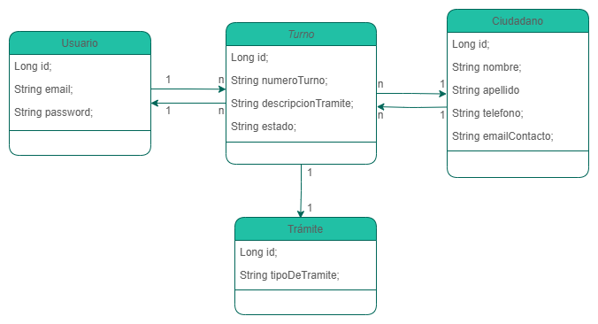

# Informe Técnico: Sistema de Gestión de Turnos

## Introducción
Este informe detalla el *desarrollo e implementación* de un sistema de gestión de turnos. Este sistema permite **crear, consultar, editar y eliminar (CRUD)** los turnos que los ciudadanos necesitan para diversos trámites administrativos.

El sistema está construido con tecnologías basadas en **Java y una arquitectura en capas**. Utiliza *JPA* para la persistencia de datos y *Servlets* para la lógica de negocio y el control de flujo de la aplicación.

### Objetivos
1. Desarrollar un sistema para gestionar turnos de trámites administrativos.

2. Permitir la edición de turnos, incluyendo cambios de estado y actualización de información.

3. Implementar una interfaz sencilla y funcional para usuarios y administradores.

### Alcance
Este sistema está destinado a administradores que gestionan los turnos de los ciudadanos, asignándolos a trámites específicos y asegurándose de que su estado pueda ser actualizado. Los usuarios pueden interactuar con el sistema para consultar y modificar sus turnos asignados.

## Funcionamiento del Sistema

### Supuestos
- Se eligió la palabra **turno** para referirse a una "cita", en función de que la BBDD se llama *turnero*.
- El sistema **no es accesible** desde una red que esté fuera de la empresa, por lo que en la pantalla de login se permite el acceso a una página de creación de usuarios.
- Se implementan dos tipos de filtrado (un filtrado lógico mediante **lambdas y streams y un filtrado directo desde la BBDD**), por lo que para evitar conflictos se optó por dejar comentado el método en donde se utilizó *programación funcional* por ser el menos eficiente.
- Se deja un apartado en el *index* para probar la función de filtrado y para evitar dejar la página principal vacía.
- No se agregó la eliminación de usuarios, ciudadanos o trámites para proteger la integridad de la BBDD.
- Por cuestión de tiempo no se pudo implementar el manejo de errores en la mayoría del sistema.

## Uso del Sistema
Es un sistema rudimentario ya que requiere tener los Id's del ciudadano, los tramites y los usuarios para que puedan ser relacionados en la BBDD.

1. Para levantar el Proyecto en el servidor se tienen las llaves -> user: **carlosH** y password: **Princesa667**.
2. Se tienen dos usuarios creados con acceso al sistema, pero se pueden crear más.
3. Se tienen que asignar los Id's de forma manual en el formulario de alta de turno. Ya se tienen creados algunos ciudadanos y tramites, pero se pueden crear más en caso de requerirlo.


  *Usuarios
   
| ID  | EMAIL                         | PASSWORD |
|-----|-------------------------------|----------|
| 1   | admin@ningunlugar.gob.com     | 123456   |
| 2   | holakase@ningunlugar.gob.com  | Hola123  |
   
  *Ciudadanos
  
| ID  | NOMBRE   | APELLIDO         | EMAILCONTACTO                      | TELEFONO       |
|-----|----------|------------------|------------------------------------|----------------|
| 1   | Carlos   | Herrera          | estoesunaprueba@mail.com           | 5464124578     |
| 2   | Dafne    | Rivera           | babyblue@gmail.com                 | 1459832145     |
| 3   | Marco    | Solis            | marcoantonio_solis@meloinvente.com | 5687465324     |
| 4   | Elia     | Ortega           | vaquita@hotmail.com                | 654216584625   |
| 5   | Coraje   | el Perro Cobarde | estupidoperro@mehicistevermal.com  | 87953548231    |

  *Tramites
  
| ID  | TIPODETRAMITE |
|-----|---------------|
| 1   | Queja         |
| 2   | Pago          |
| 3   | Consulta      |
| 4   | Reporte       |

4. En el *index.jsp* hay un buscador por "estado" del trámite.
5. En *verTurnos.jsp* hay una tabla con las funciones de borrado y edición de los turnos.

## Tecnologías Utilizadas
+ Lenguaje de programación: Java

+ Frameworks:

  + JPA (Java Persistence API): Para la persistencia de datos.

  + Servlets: Para la lógica de control de la aplicación.

  + JSP (JavaServer Pages): Para la interfaz web.

+ Base de datos: Relacional (MySQL).

+ IDE: NetBeans

+ Servidor de aplicaciones: Apache Tomcat

+ Interfaz gráfica: Plantilla descargada

### Diseño del Sistema
El sistema maneja varias entidades clave:



### Estructura de la Base de Datos
La base de datos está compuesta por las siguientes tablas:

- Turno: Detalles de cada turno.

- Ciudadano: Información personal de los ciudadanos.

- Trámite: Diferentes tipos de trámites.

- Usuario: Datos de los usuarios administradores del sistema.


### Implementación de Funcionalidades
Creación de Turnos Asignar un número de turno, una especificación del tipo de trámite, fecha y estado, almacenándolos en la base de datos y asociándolos con un ciudadano, trámite y usuario.

#### Código

##### Seguridad

Se introduce el siguiente código en el componente *bodyinicio* para mantener protegido el sistema de personas que no tengan credenciales de usuario.

```jsp
<%
    HttpSession miSesion = request.getSession();
    String usuario = (String) miSesion.getAttribute("email");
    if (usuario == null) {
        response.sendRedirect("login.jsp");
    }
%>
```

#### Funcionalidad
Se introduce este fragmento para crear un filtro personalizado usando JPQL (Java Persistence Query Language).

```jpql
Usuario findUserByEmail(String email) {
    EntityManager em = getEntityManager();
    
    try {
        String consulta = "SELECT usu FROM Usuario usu WHERE usu.email = :email";
        Query query = em.createQuery(consulta);
        query.setParameter("email", email);
        return (Usuario) query.getSingleResult();
    } catch (NoResultException e) {
        return null;
    } finally {
        em.close();
    }
}
```

### Consideraciones de Seguridad
Autenticación y autorización: Uso de correos y contraseñas para controlar el acceso a funcionalidades.

## Conclusiones
El sistema de gestión de turnos cumple de forma muy básica con los requisitos iniciales y está basado en una arquitectura que facilita su mantenimiento y extensión. Aún se pueden seguir añadiendo funcionalidades como la edición de ciudadanos y trámites, así como su eliminación; el uso de menús desplegables para evitar la introducción de errores por parte del Usuario; y los roles del Usuario para manejar permisos.
